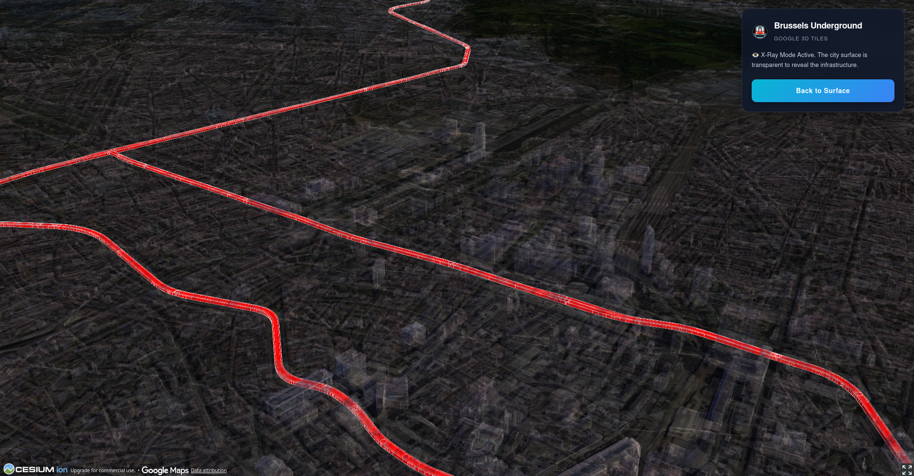

# 🚇 Brussels 3D Underground Explorer



[](https://vercel.com/new/clone?repository-url=https%3A%2F%2Fgithub.com%2FJLecache%2Fbrussels-3d-subway-underground)


An interactive 3D geospatial application visualizing the **Brussels Metro Network** beneath the city's surface. This project leverages **Google Photorealistic 3D Tiles** and **CesiumJS** to create an immersive "X-Ray" experience, allowing users to see infrastructure depth relative to real-world urban environments.

[**🔗 Live Demo**](https://brussels-3d-subway-underground.vercel.app/)

---

## ✨ Key Features

* **🌍 Photorealistic Rendering:** Utilizes Google 3D Tiles via Cesium Ion for high-fidelity city visualization (Mesh + Textures).
* **👁️ X-Ray Mode:** A custom toggle that renders the city surface transparent, revealing underground assets without losing context.
* **🚇 3D Volumetric Generation:** Dynamically transforms 2D GeoJSON LineStrings into 3D geometric corridors (tunnels) at accurate depths.
* **🎥 Smart Navigation:** Instant camera positioning logic to start the experience directly in Brussels.
* **⚡ High Performance:** Built with Vite for instant server start and optimized bundle size.

---

## 🛠️ Technical Stack

* **Core:** React 19, TypeScript
* **Build Tool:** Vite
* **3D Engine:** CesiumJS (Native integration within React hooks)
* **Data Source:**
    * *Terrain & Buildings:* Google Photorealistic 3D Tiles (Asset ID 2275207)
    * *Metro Network:* Custom GeoJSON processed at runtime
* **Deployment:** Vercel (CD/CI) + Vercel Analytics

---

## 💡 Technical Challenges & Solutions

Developing this application required solving several specific geospatial engineering challenges:

### 1. The "Levitating Buildings" Problem
* **Challenge:** When combining standard OSM buildings with a separate World Terrain provider, buildings in Brussels (a hilly city) often appeared floating or sunken due to Vertical Datum mismatches between datasets.
* **Solution:** Migrated to **Google Photorealistic 3D Tiles**. Since these tiles mesh the terrain and buildings into a single geometry, the relative altitude is perfect by design, eliminating the need for manual offset adjustments or complex terrain providers.

### 2. Rendering Underground Depth
* **Challenge:** Standard web maps (like Mapbox or Leaflet) render lines "draped" on the surface. They cannot represent true negative altitude (Z-index).
* **Solution:** Used Cesium entities with `CorridorGraphics`.
    * Configured `height` to **30.0** (absolute altitude) and `extrudedHeight` to **20.0**.
    * Since Brussels' street level averages ~60m, this places the tunnels physically ~30m to 40m underground relative to the surface.

### 3. The "X-Ray" Effect
* **Challenge:** Allowing the user to see through the ground without breaking the camera controls or falling into the "void".
* **Solution:** Implemented a `useEffect` hook that dynamically:
    1.  Enables `globe.translucency` with a `NearFarScalar`.
    2.  Modifies the 3D Tileset style to `color('white', 0.1)` (90% transparent).
    3.  Keeps `enableCollisionDetection = true` to prevent the user from accidentally falling through the world while exploring.

---

## 🚀 Getting Started

To run this project locally:

1.  **Clone the repository**
    ```bash
    git clone [https://github.com/JLecache/brussels-3d-subway-underground.git](https://github.com/JLecache/brussels-3d-subway-underground.git)
    cd brussels-3d-subway-underground
    ```

2.  **Install dependencies**
    ```bash
    npm install
    ```

3.  **Configure Environment Variables**
    Create a `.env` file in the root directory and add your Cesium Ion Token:
    ```env
    VITE_CESIUM_TOKEN=your_cesium_token_here
    ```

4.  **Run the development server**
    ```bash
    npm run dev
    ```

---

## 📂 Project Structure

```bash
src/
├── MapComponent.tsx       # Main Cesium logic (Native integration & UI)
├── main.tsx               # Entry point & Vercel Analytics
├── vite-env.d.ts          # TypeScript declarations
public/
└── metro.geojson          # Served statically for fetch requests